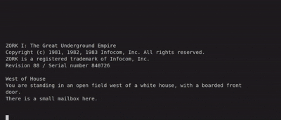

# 🎮 AIZork: Let Your LLM Play Zork!

<p align="center">
  
  
  
</p>

## 📖 Description

AIZork is a project that lets Large Language Models (LLMs) play the classic text adventure game Zork I: The Great Underground Empire. Watch as AI navigates the underground empire, solves puzzles, and attempts to win the game through natural language commands.

This project demonstrates how modern AI can interact with classic interactive fiction games through a pseudo-terminal interface, with optional Retrieval-Augmented Generation (RAG) assistance using ChromaDB.

<p align="center">
  
</p>

### Features

- 🤖 Supports Ollama with Llama 3.2:3B (default)
- 🎮 Fully automated gameplay through AI decision-making
- 🔄 Real-time interaction with the Zork game environment
- 📊 Observe how AI interprets game context and generates commands
- 💬 Ability to provide suggestions to guide the AI during gameplay
- 🧩 Structured output using Pydantic for reliable command generation
- 📚 ChromaDB-powered RAG system for better gameplay assistance

## 🔧 Prerequisites

- **Python 3.8+** - For running the main application
- **[Ollama](https://ollama.ai/)** - For Ollama-based LLM inference
- **[Dosemu2](https://github.com/dosemu2/dosemu2)** - DOS emulator to run Zork
- **Zork I: The Great Underground Empire** - DOS version of the game

### Python Dependencies

- **ollama** - For Ollama API integration
- **pydantic** - For data validation and structured output
- **colorama** - For colored terminal output
- **chromadb** - For vector database and RAG functionality

All dependencies can be installed via the provided `requirements.txt` file.

## 📁 Directory Structure

```
.
├── ZORK/           # Directory containing Zork game files
├── walkthroughs/   # Directory containing Zork walkthrough documents for RAG
│   ├── zork_walkthrough.md           # Markdown-based walkthrough
│   ├── zork_command_sequence.txt     # Linear command sequence
│   └── zork_location_guide.md        # Location-based reference guide
├── main.py         # Main application script
├── rag.py          # RAG system implementation
├── requirements.txt # Project dependencies
└── README.md       # Project documentation
```

## 🚀 Installation

1. Clone the repository:
   ```bash
   git clone https://github.com/yourusername/AIZork.git
   cd AIZork
   ```

2. Set up a virtual environment:
   ```bash
   python3 -m venv .venv
   source .venv/bin/activate  # On Windows: .venv\Scripts\activate
   ```

3. Install dependencies:
   ```bash
   pip install -r requirements.txt
   ```

4. Place your Zork DOS game files in the `ZORK` directory

5. Set up Ollama:
   ```bash
   ollama pull llama3.2:3B
   ```

6. Create a `walkthroughs` directory and add your Zork walkthrough documents:
   ```bash
   mkdir -p walkthroughs
   # Add walkthrough files to this directory
   ```

## 🎮 Usage

Start the AIZork application:

```bash
python3 main.py
```

The AI will automatically begin playing Zork using the Ollama backend. You can observe its decisions and gameplay in real-time.

### Game Modes

AIZork supports different game modes:

1. **Autoplay Mode** (default): The AI plays the game completely autonomously.
   ```bash
   python3 main.py
   ```

2. **Suggestion Mode**: You can provide suggestions to guide the AI during gameplay.
   ```bash
   python3 main.py --mode suggestion
   ```
   When prompted with "Suggest:", you can type a suggestion that will be passed to the AI.

3. **RAG-Assisted Mode**: Enable the RAG helper to assist the AI with walkthrough information:
   ```bash
   python3 main.py --rag-helper
   ```
   This uses ChromaDB to provide context-aware suggestions to the AI based on the current game state.

## 📚 ChromaDB RAG System

The RAG (Retrieval-Augmented Generation) system enhances the AI's gameplay by providing context-aware suggestions based on Zork walkthroughs. The system uses:

1. **Intelligent Document Chunking**:
   - **Markdown Files**: Split by headers to preserve logical sections
   - **Text Files**: Split into overlapping chunks with natural break points

2. **Vector Database**:
   - Uses ChromaDB to store document chunks and their vector embeddings
   - Enables semantic search to find the most relevant information for the current game state

3. **Duplicate Detection**:
   - Prevents similar suggestions from being shown multiple times
   - Ensures diverse and helpful information is provided to the AI

The RAG system helps the AI navigate complex areas, solve puzzles, and make better decisions during gameplay.

## 🧠 How It Works

1. **Game Interaction**:
   - AIZork uses a pseudo-terminal to interact with the Zork game running in Dosemu
   - The AI reads the game output and generates appropriate commands

2. **AI Decision Making**:
   - The game context is sent to the Ollama LLM
   - The LLM generates a structured command response
   - The command is sent back to the game

3. **RAG Assistance**:
   - When enabled, the current game context is also sent to the RAG system
   - ChromaDB retrieves the most relevant walkthrough information
   - This information is provided to the AI to help it make better decisions